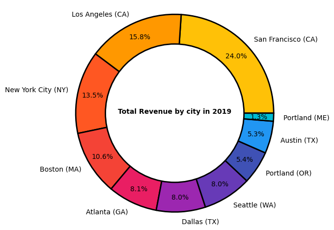

# Sales Analysis

This repository contains a data analysis project on sales data for the year 2019. The goal of this project is to merge 12 monthly sales datasets into one master dataset to facilitate analysis, clean the dataset, and perform exploratory data analysis (EDA) to uncover insights and answer business questions.
Dataset

The dataset used in this project includes 12 CSV files containing sales data for each month of the year. Each CSV file contains the following columns:

* Order ID: A unique identifier for each order
* Product: The name of the product sold
* Quantity Ordered: The quantity of the product sold in each order
* Price Each: The price of the product sold in each order
* Order Date: The date and time when the order was placed
* Purchase Address: The address where the order was shipped

## Importing and cleaning the dataset
### Importing

The first step in the data analysis process is to import and clean the dataset. The code in sales_analysis.ipynb demonstrates how to merge the 12 monthly sales datasets into one master dataset using Pandas' read_csv and merge functions. The resulting dataset is saved to a CSV file called all_data.csv.
### Cleaning

Before starting the exploratory data analysis, it's necessary to clean the dataset. The code in sales_analysis.ipynb removes null values and duplicates, casts the columns "Quantity Ordered" and "Price Each" to numbers, creates a new column called "Revenue" by multiplying the "Quantity Ordered" and "Price Each" columns to get the total revenue for each order, converts the "Order Date" column to a datetime data type using pandas' "to_datetime" function, and creates new columns for the hour, minute, and day of the week of each order using pandas' datetime functions.
Exploratory data analysis

Once the dataset has been cleaned, we can perform exploratory data analysis (EDA) to uncover insights and answer business questions. The code in sales_analysis.ipynb demonstrates how to use Matplotlib to create visualizations that help us better understand the data. Examples:
* Explore the distribution of sales by month, hour, and day of the week using line charts and heatmaps 
* Analyze the correlation between different variables using scatter plots and correlation matrices 
* Analyze the geographic distribution of sales using donut charts and scatter plots 

Conclusion

In conclusion, this project provides a comprehensive analysis of sales data for the year 2019. By merging, cleaning, and exploring the dataset, we were able to uncover insights and answer business questions that can help improve the performance of the company. The code in sales_analysis.ipynb can be used as a reference for future data analysis projects and can be adapted to other datasets with similar characteristics.
